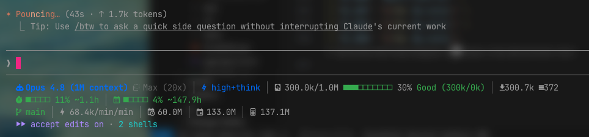

# Claude Code Enhanced Status Line

Claude Code 用のカスタムステータスラインスクリプトです。ターミナル下部に、モデル・契約プラン・コンテキスト使用量・レートリミット・Git 状態・トークン消費履歴などを 3 行で表示します。Ghostty での利用を想定していますが、Nerd Fonts に対応したターミナルであれば動作します。

## 表示イメージ



ステータスラインは 3 行構成で、1 行目にセッション情報（モデル・プラン・コンテキストなど）、2 行目にレートリミット、3 行目に履歴・Git を表示します。

> **Note:** 上記の画像は Nerd Fonts を設定したターミナルでの実際の表示例です。アイコンは Nerd Fonts のグリフを使用しているため、対応フォントのない環境（GitHub の生テキスト表示など）では正しく表示されません。

## 必要なもの

- **bash**（macOS / Linux）
- **jq** — JSON のパースに使用します。未インストールの場合は導入してください。
  - macOS: `brew install jq`
  - Debian/Ubuntu: `sudo apt install jq`
- **Nerd Fonts** — アイコン表示に必要です。未対応フォントだとアイコンが豆腐（□）になります。
- **git**（任意） — リポジトリ内にいるときのみ Git 情報を表示します。

## インストール

1. スクリプトを `~/.claude/statusline.sh` として保存します。

2. 実行権限を付与します。

   ```bash
   chmod +x ~/.claude/statusline.sh
   ```

3. `~/.claude/settings.json` に以下を追加します（既存の設定があれば `statusLine` キーをマージしてください）。

   ```json
   {
     "statusLine": {
       "type": "command",
       "command": "~/.claude/statusline.sh"
     }
   }
   ```

4. Claude Code を再起動すると、ターミナル下部にステータスラインが表示されます。

## 設定

### 契約プラン名

プラン情報は Claude Code から渡される JSON に含まれないため、スクリプト冒頭でハードコードしています。自分のプランに合わせて書き換えてください。

```bash
# ====== 契約プラン名 (ここを自分のプランに書き換えてください) ======
PLAN_NAME="Max (20x)"
# ===================================================================
```

### アイコン

スクリプト上部の `I_*` 変数で各項目のアイコンを定義しています。フォントによって未収録のグリフがあるため、豆腐になる場合は別のグリフに差し替えてください。

```bash
I_AI="󰚩"      # モデル
I_PLAN="󰉇"    # プラン（スパークル）
I_CTX="󰋊"     # コンテキスト
...
```

## 表示項目

### 1 行目

| 項目 | 内容 |
|---|---|
| モデル名 | 使用中のモデル表示名 |
| プラン名 | 契約プラン（ハードコード値） |
| Effort / 思考 | Effort レベル。思考が有効なときは `+think` が付き青色、無効なときは薄色 |
| コンテキスト使用量 | 現在の使用トークン / コンテキストサイズ＋進捗バー＋使用率 |
| パフォーマンスゾーン | Good / Caution / Warning / Critical。括弧内はキャッシュ内訳（Read/Write） |
| 入力トークン | セッション累計の入力トークン |
| 出力トークン | セッション累計の出力トークン |

### 2 行目（レートリミット）

| 項目 | 内容 |
|---|---|
| レートリミット（5 時間枠） | 視覚バー＋使用率＋リセットまでの残り時間 |
| レートリミット（7 日枠） | 視覚バー＋使用率＋リセットまでの残り時間 |

### 3 行目（履歴・Git）

| 項目 | 内容 |
|---|---|
| Git ブランチ | ブランチ名＋変更状態（`*` 変更 / `+` ステージ / `?` 未追跡）。リポジトリ内のみ表示 |
| バーンレート | トークン消費速度（/min） |
| 日次合計 | 当日の累計トークン |
| 週次合計 | 過去 7 日間の累計トークン |
| 月次合計 | 過去 30 日間の累計トークン |

## 色のルール

色は情報量を持っています。

- **コンテキスト使用率 / パフォーマンスゾーン**
  - 50% 未満: 緑（Good）
  - 50〜70%: 黄（Caution）
  - 70〜90%: 黄（Warning）
  - 90% 以上: 赤＋太字（Critical）
- **レートリミット使用率**（視覚バー・数値・リセット時刻が連動して色付き）
  - 50% 未満: 緑
  - 50〜80%: 黄
  - 80% 以上: 赤
  - 視覚バーは 5 段階（20% 区切り）。ただし使用率が 0% より大きい場合は、最低 1 マスを点灯させます（わずかな使用が空バーに見えるのを防ぐため）。

## 生成されるファイル

バーンレートと履歴集計のため、`~/.claude/` 配下に以下のファイルを作成・更新します。

| ファイル | 用途 |
|---|---|
| `.sl_session.json` | セッション開始時刻（バーンレート計算用） |
| `.sl_last_state.json` | 直近の状態（セッション切り替え検出用） |
| `.sl_usage_log.csv` | 過去セッションのトークン消費ログ（日次/週次/月次集計用） |

## 仕組み

Claude Code はステータスラインコマンドに対し、セッション情報を JSON として標準入力（stdin）で渡します。スクリプトはこれを `jq` でパースし、整形して標準出力に表示します。プラン名のように JSON に含まれない情報は、スクリプト内でハードコードまたは別途取得しています。

JSON に含まれるフィールドは Claude Code のバージョンによって変わることがあります。利用可能なフィールドを確認したいときは、スクリプト冒頭の入力読み込みを一時的に次のように変更すると、生 JSON を保存できます（確認後は元に戻してください）。

```bash
input=$(cat | tee "$HOME/claude_input.json")
```

保存した内容は次のコマンドで確認できます。

```bash
jq . ~/claude_input.json
```

## トラブルシューティング

- **アイコンが □ になる** — フォントが Nerd Fonts でないか、該当グリフが未収録です。Nerd Fonts をインストールするか、`I_*` 変数を別グリフに差し替えてください。
- **何も表示されない** — `jq` がインストールされているか確認してください。スクリプトは入力が空または不正な JSON のときは何も表示せず終了します。
- **Git 情報が出ない** — Git リポジトリ内でのみ表示されます。

## ライセンス

自由に利用・改変してください。
